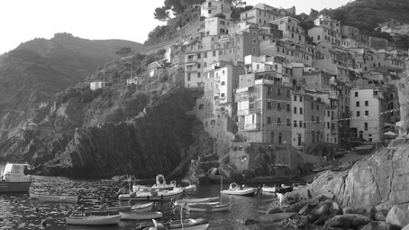
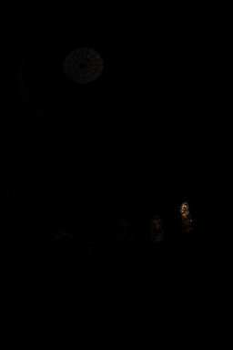
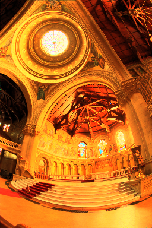

cs344 - Introduction to Parallel Programming
=====

In this repo you'll find my work about CUDA Programming on nVidia GPUs.
My code is in the ```student_func.cu``` file in each Problem Set

# Problem description and explanation

## Problem Set 1

A basic greyscale conversion is done here. Use of the *map* pattern.


and the result performed in 0.037184 ms.




## Problem Set 2

An image blur is performed here. First I performed a Array of Structures (AoS) to Structure of Arrays (SoA) conversion to enable coalescing memory access later on.
Then, I make use of a *stencil* to give each pixel a weight is the output pixel produced. I do so for each Red, Green and Blue channels.


and I obtain this result in 1.712864 ms.


## Problem Set 3

This problem highlights the construction of High Dynamic Range (HDR) images that contains a wider variation of intensity and color than is allowed by the RGB format with 1 byte per channel.
In the image for this assignment, the inside of church with light coming in through stained glass windows, the raw input floating point values for the channels range from 0 to 275.  But the mean is .41 and 98% of the values are less than 3! This means that certain areas (the windows) are extremely bright compared to everywhere else. If we linearly map this [0-275] range into the [0-255] range that we have been using then most values will be mapped to zero! The only thing we will be able to see are the very brightest areas - the windows - everything else will appear pitch black.



The idea is that a Tone-mapping algorithm needs to be performed. I transformed the luminance channel (the log of the luminance) by compressing its range to [0, 1]. I first created a *histogram* of the values the luminance and then calculated the cumulative distribution of the luminance values known as *Hillis and Steele scan*. The actual tone-mapping is done by Udacity's team.



My part of the code is performed in 1.59904 ms.

## Problem Set 4

...

## Problem Set 5

...

## Problem Set 6

...

## Problem Set 7

...


## Building on OS X

These instructions are for OS X 10.9 "Mavericks".

* Step 1. Build and install OpenCV. The best way to do this is with
Homebrew. However, you must slightly alter the Homebrew OpenCV
installation; you must build it with libstdc++ (instead of the default
libc++) so that it will properly link against the nVidia CUDA dev kit.
[This entry in the Udacity discussion forums](http://forums.udacity.com/questions/100132476/cuda-55-opencv-247-os-x-maverick-it-doesnt-work) describes exactly how to build a compatible OpenCV.

* Step 2. You can now create 10.9-compatible makefiles, which will allow you to
build and run your homework on your own machine:
```
mkdir build
cd build
cmake ..
make
```
